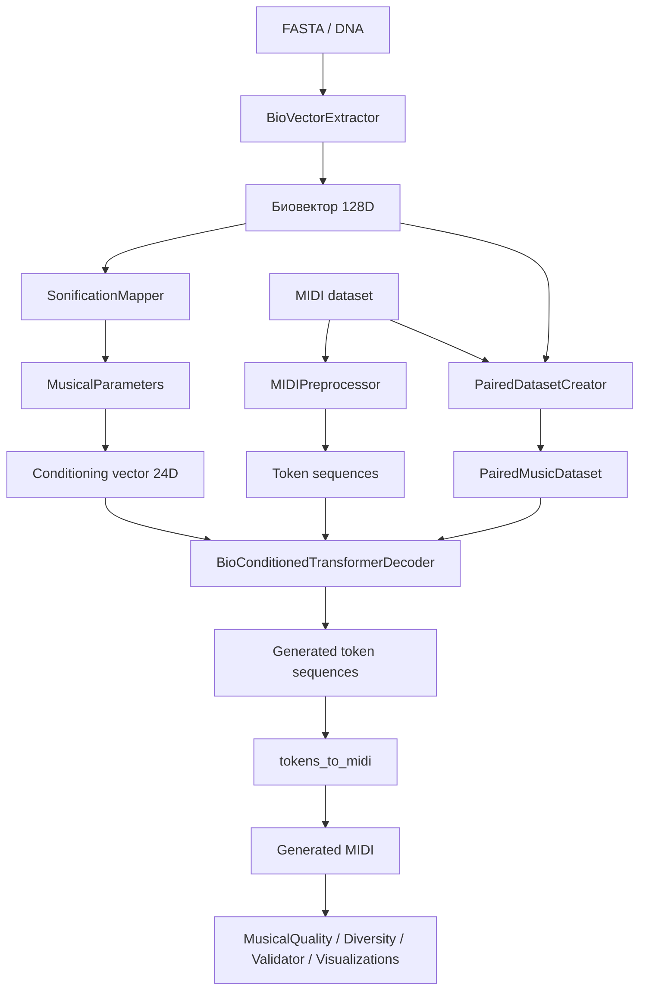

# BioSonification

Полная документация проекта генерации символической музыки по биологическим последовательностям.

Этот репозиторий реализует воспроизводимый исследовательский пайплайн, в котором FASTA-последовательности преобразуются в фиксированные биовекторы, затем в детерминированные музыкальные параметры, а после этого используются как условие для авторегрессионной Transformer-модели, генерирующей MIDI-последовательности. Проект объединяет инженерную реализацию, экспериментальный протокол, статистическую проверку гипотез, набор baseline-моделей, визуализации, скрипты для мульти-seed экспериментов и веб-интерфейс.

## Важная научная оговорка

Проект **не утверждает и не доказывает** причинно-следственную связь между генами и музыкой. Биологические признаки здесь трактуются как **структурированные управляющие сигналы**, а не как доказательство существования «музыкальности» генома. Научная задача проекта состоит не в биологической интерпретации музыки, а в проверке того, может ли детерминированное биологическое условие статистически влиять на структуру генерируемой символической музыки.

## Как устроена эта документация

Этот `README.md` служит главной «входной точкой» и обзорной энциклопедией проекта. Для максимальной глубины рядом вынесены отдельные главы:

| Документ | Назначение |
|---|---|
| [`docs/architecture_and_science.md`](docs/architecture_and_science.md) | Научная постановка, методология, формулы, обучение, генерация, метрики, гипотезы, текущие результаты |
| [`docs/code_walkthrough.md`](docs/code_walkthrough.md) | Подробный walkthrough по коду: от `run_pipeline.py` до отдельных модулей, классов и функций |
| [`docs/project_structure.md`](docs/project_structure.md) | Подробный файловый каталог проекта: исходники, конфиги, данные, результаты, веб-слой, инструменты, внешние включения |
| [`docs/thesis_chapters.md`](docs/thesis_chapters.md) | Связная заготовка глав дипломной работы: введение, постановка задачи, архитектура, эксперимент, результаты, заключение |

Если нужен «дипломный» вариант чтения, оптимальный порядок такой:

1. Прочитать этот `README.md` как общую карту проекта.
2. Перейти в [`docs/architecture_and_science.md`](docs/architecture_and_science.md) за научной частью.
3. Перейти в [`docs/code_walkthrough.md`](docs/code_walkthrough.md) за инженерной реализацией.
4. Прочитать [`docs/thesis_chapters.md`](docs/thesis_chapters.md) как основу для текста диплома.
5. Использовать [`docs/project_structure.md`](docs/project_structure.md) как справочник по файлам и артефактам.

## Что решает проект

Проект отвечает на вопрос: можно ли построить воспроизводимый пайплайн, в котором:

1. Биологическая последовательность переводится в числовое представление.
2. Это представление детерминированно маппится на музыкальные параметры.
3. Нейросетевая модель использует этот сигнал как conditioning.
4. Результат сравнивается с baseline-подходами статистически, а не только на уровне «демо».

## Исследовательские гипотезы

В текущей постановке в проекте заложены две основные гипотезы.

1. `H1`: conditioned-генерация превосходит unconditional-генерацию по композитной метрике музыкального качества.
2. `H2`: из музыкальных признаков сгенерированных последовательностей можно статистически восстановить кластерную структуру биовекторов.

Именно вокруг этих гипотез построен блок оценки в `bio_music_pipeline/evaluation/validator.py`.

## Архитектура проекта в одном блоке



## Пайплайн по стадиям

### Стадия 1. Извлечение биовекторов

Источник: `bio_music_pipeline/extractors/bio_extractor.py` и `bio_music_pipeline/extractors/fasta_loader.py`.

На этом этапе FASTA-последовательности:

1. Очищаются от всех символов, кроме `A`, `C`, `G`, `T`.
2. Отбрасываются, если короче заданного порога `min_sequence_length`.
3. Преобразуются в набор признаков:
   - частоты нуклеотидов,
   - глобальная энтропия Шеннона,
   - `GC skew`,
   - `AT skew`,
   - распределения `k`-меров для `k = 1, 2, 3`,
   - средние и стандартные отклонения оконной `GC`-составляющей и энтропии.
4. Собираются в фиксированный вектор длиной `128`.

Фактическая структура биовектора:

| Блок | Размерность |
|---|---:|
| `nuc_freqs` | 4 |
| `entropy` | 1 |
| `gc_skew` | 1 |
| `at_skew` | 1 |
| `kmer_1` | 4 |
| `kmer_2` | 16 |
| `kmer_3` | 64 |
| `gc_window_mean` | 1 |
| `gc_window_std` | 1 |
| `entropy_window_mean` | 1 |
| `entropy_window_std` | 1 |
| Сумма «сырых» признаков | 95 |
| Внутренний zero-padding до 124 | 29 |
| Итоговые summary-статистики | 4 |
| Полный биовектор | 128 |

Последние 4 измерения всегда используются под summary-статистики:

- среднее,
- стандартное отклонение,
- минимум,
- максимум.

Это важно, потому что модуль абляции опирается именно на фиксированные индексы этих компонент.

### Стадия 2. Детерминированная сонификация

Источник: `bio_music_pipeline/sonification/mapper.py`.

Сонификация не генерирует музыку напрямую. Она переводит биовектор в **прозрачный набор музыкальных управляющих параметров**:

- `key`,
- `tempo`,
- `pitch_range`,
- `rhythm_complexity`,
- `chord_distribution`,
- `scale_type`,
- `articulation_density`,
- `dynamic_range`.

Ключевые правила:

- частоты нуклеотидов маппятся в положение на круге квинт;
- энтропия маппится в темп;
- `GC/AT skew` маппятся в сдвиг диапазона высот;
- разнообразие `k`-меров влияет на ритмическую сложность;
- `GC`-содержание влияет на модальность лада;
- оконная вариативность влияет на плотность артикуляции;
- усреднённый сигнал по первым 16 признакам влияет на распределение аккордов.

Дополнительно работает калибровка:

- `SonificationMapper.fit_calibration()` оценивает эмпирические диапазоны по батчу биовекторов;
- это нужно, чтобы реальные данные использовали весь доступный диапазон ключей и темпов, а не схлопывались в узкий поддиапазон.

На выходе строится conditioning-вектор размерности `24`:

| Компонент | Размерность |
|---|---:|
| one-hot по 12 тональным центрам | 12 |
| нормализованный темп + границы pitch range | 3 |
| one-hot scale type | 5 |
| rhythm/articulation/dynamics | 4 |
| Итого | 24 |

### Стадия 3. Подготовка музыкального датасета

Источники:

- `bio_music_pipeline/data/dataset.py`
- `bio_music_pipeline/data/paired_dataset_creator.py`
- `bio_music_pipeline/data/paired_dataset.py`

В проекте существуют два режима обучения.

#### 1. Непарный режим

`MusicDataset` просто:

1. рекурсивно ищет MIDI-файлы,
2. токенизирует их,
3. разбивает на `train/val/test` без пересечений.

В этом режиме биовекторы в обучении подмешиваются случайным образом внутри batch-а, поэтому для серьёзной научной постановки он служит скорее fallback-режимом.

#### 2. Парный режим

Это основной исследовательский сценарий.

`PairedDatasetCreator`:

1. сканирует MIDI-файлы,
2. извлекает статистические признаки MIDI,
3. извлекает биовекторы из FASTA,
4. сортирует оба множества по сложности,
5. сопоставляет их по рангу.

Сложность MIDI в текущем коде задаётся как:

`0.6 * pitch_entropy + 0.4 * velocity_entropy`

Сложность биовектора задаётся как:

`var(bio_vector) + mean(abs(bio_vector))`

После этого создаются файлы:

- `paired_data.json`,
- `paired_bio_vectors.npy`,
- `paired_conditioning_vectors.npy`,
- `pairs_manifest.csv`,
- `paired_stats.json`.

Далее `PairedMusicDataset` читает этот набор и отдаёт уже корректные пары:

- `token_ids`,
- `bio_vector`,
- `conditioning_vector`,
- метаданные по паре.

### Стадия 4. Обучение модели

Источник: `bio_music_pipeline/models/transformer.py` и метод `stage4_train_model_with_paired_data()` в `run_pipeline.py`.

Главная модель проекта: `BioConditionedTransformerDecoder`.

Её состав:

1. `token_embedding`
2. `PositionalEncoding`
3. стек `TransformerEncoderLayer`, используемый как декодер с каузальной маской
4. `BioConditioningModule`, который встраивает биовектор в скрытое состояние
5. `output_proj` в пространство токенов
6. `AuxiliaryLanguageModel` с замороженными весами
7. `GumbelSoftmaxSampler`

Особенности обучения:

- `vocab_size` берётся не из конфига «вслепую», а синхронизируется с `MIDIPreprocessor`;
- используется `AdamW`;
- применяется `gradient clipping`;
- работает `early stopping`;
- на каждом шаге обновляется температура Gumbel-Softmax.

Функция потерь:

`total_loss = cross_entropy + aux_loss_weight * auxiliary_cross_entropy`

Зачем нужен auxiliary LM:

- его веса заморожены;
- однако через него всё равно проходят градиенты;
- это добавляет дополнительное регуляризующее давление на скрытые представления.

### Стадия 5. Генерация и оценка

`run_pipeline.py` после обучения строит не одну, а сразу несколько групп генераций:

| Режим | Что означает |
|---|---|
| `conditioned` | основная модель с реальными биовекторами |
| `unconditional` | нейросетевая baseline-модель без conditioning |
| `random` | случайная генерация токенов |
| `markov` | генерация марковской цепью |
| `rule_based` | генерация напрямую из параметров сонификации |
| `random_vector` | контроль: те же размеры conditioning, но случайные векторы |

Это важно для дипломной логики: проект сравнивает не просто «нашу модель» против «ничего», а оценивает вклад conditioning на нескольких уровнях.

## Как представлена музыка в модели

Вокабуляр `MIDIPreprocessor` устроен так:

- `NOTE_ON_<pitch>` для всех высот `21..108`,
- `NOTE_OFF_<pitch>` для тех же высот,
- `SHIFT_0..SHIFT_100`,
- `VEL_0..VEL_127`,
- `BOS`, `EOS`, `PAD`.

Точная мощность словаря:

- `88 * 2 = 176` токенов для note on/off,
- `101` токен shift,
- `128` токенов velocity,
- `3` специальных токена,
- итого `408`.

Таким образом, модель не оперирует сырой MIDI-матрицей, а работает с символьной последовательностью музыкальных событий.

## Как именно строится генерация

Во время генерации модель:

1. получает биовектор размера `128`,
2. стартует с `BOS`,
3. на каждом шаге предсказывает распределение следующего токена,
4. запрещает `EOS`, пока не достигнута минимальная длина `min_generation_length`,
5. сэмплирует следующий токен,
6. повторяет процесс до достижения `max_seq_len`.

После этого `tokens_to_midi()` преобразует токены обратно в MIDI-файл:

- `SHIFT_*` накапливают время,
- `NOTE_ON_*` добавляют ожидающую ноту,
- `VEL_*` задают velocity,
- `NOTE_OFF_*` закрывают ноту и создают MIDI-событие.

## Как проект считает метрики

Оценка делится на несколько уровней.

### 1. Музыкальное качество

Источник: `bio_music_pipeline/evaluation/musical_quality.py`.

Считаются:

- tonal stability,
- rhythmic regularity,
- melodic coherence,
- harmonic richness,
- self-similarity,
- repetition rate.

Поверх этого в `validator.py` строится композитный score:

`0.8 * mean(core musical metrics) + 0.2 * structural token quality`

### 2. Проверка гипотезы H1

`StatisticalValidator.compute_disentanglement_gap()` сравнивает conditioned и unconditional по композитной метрике:

- средний разрыв,
- Welch t-test,
- `p-value`,
- `Cohen's d`,
- bootstrap CI для разницы средних.

### 3. Проверка гипотезы H2

`InformationTransferClassifier`:

1. кластеризует биовекторы через `KMeans`,
2. извлекает признаки из сгенерированных последовательностей,
3. обучает `RandomForestClassifier`,
4. оценивает accuracy и balanced accuracy по cross-validation,
5. подтверждает или опровергает значимость через permutation test.

### 4. Дополнительные исследовательские блоки

В проекте также есть:

- абляционные эксперименты,
- анализ разнообразия,
- энтропийные метрики сложности,
- интеграция с `IDyOMpy`,
- научные визуализации,
- human evaluation survey.

Подробно всё это разобрано в [`docs/architecture_and_science.md`](docs/architecture_and_science.md).

## Текущие результаты полного запуска

В репозитории присутствует завершённый прогон `results/full_paired_run`, собранный `2026-04-17`.

Ключевые числа:

| Показатель | Значение |
|---|---:|
| Число FASTA-последовательностей | 2000 |
| Размер биовектора | 128 |
| Размер conditioning-вектора | 24 |
| Число пар MIDI↔bio | 434 |
| Train / Val / Test | 303 / 65 / 66 |
| Размер словаря | 408 |
| Параметров модели | 6,278,768 |
| Лучшая `val_loss` | 2.9736 |
| Сгенерировано MIDI | 360 |
| H1 `p-value` | 0.0003929 |
| H1 `Cohen's d` | 0.6719 |
| H2 accuracy | 0.4000 |
| H2 permutation `p-value` | 0.2218 |

Интерпретация:

- `H1` поддержана: conditioned-генерация статистически лучше unconditional по композитной музыкальной метрике.
- `H2` в текущей конфигурации не подтверждена: accuracy выше chance level, но permutation test не дал статистической значимости.

## Как запустить проект

### Установка

```bash
python3 -m venv .venv
source .venv/bin/activate
pip install --upgrade pip
pip install -r requirements.txt
```

### Полный сценарий с нуля

Подробная инструкция лежит в [`RUN_FROM_SCRATCH.md`](RUN_FROM_SCRATCH.md).

Короткая последовательность:

```bash
python3 -m bio_music_pipeline.data.paired_dataset_creator \
  --midi-dir data/midi \
  --fasta-path data/fasta \
  --output-dir results/paired_data \
  --config configs/pipeline_full_paired.json

python3 run_pipeline.py \
  --config configs/pipeline_full_paired.json \
  --midi-dir data/midi \
  --paired-data results/paired_data
```

### Быстрый одиночный sanity check

```bash
python3 generate_from_fasta.py \
  --fasta data/fasta/training/Homo_sapiens.GRCh38.cds.all.fa \
  --record-index 7 \
  --fragment-length 2200 \
  --model results/full_paired_run/models/best_model.pt \
  --output results/single_fasta_check/fasta_record7_fragment.mid
```

### Multi-seed сценарий

```bash
python3 tools/run_multi_seed_experiments.py \
  --base-config configs/pipeline_full_paired.json \
  --seeds 7,42,123,2026,31415 \
  --paired-data results/paired_data \
  --midi-dir data/midi
```

### Генерация исследовательских артефактов

```bash
python3 tools/generate_research_artifacts.py \
  --roots results \
  --output-dir results/research_artifacts
```

## Как послушать результат

В проекте есть несколько способов работать с результатами.

### 1. Открыть готовые MIDI из эксперимента

Главные директории:

- `results/full_paired_run/midi/conditioned/`
- `results/full_paired_run/midi/unconditional/`
- `results/full_paired_run/midi/random/`
- `results/full_paired_run/midi/markov/`
- `results/full_paired_run/midi/rule_based/`
- `results/full_paired_run/midi/random_vector/`

Их можно открыть в:

- MuseScore,
- GarageBand,
- Logic Pro,
- Ableton Live,
- Reaper,
- любом MIDI-плеере или DAW.

### 2. Сгенерировать музыку через веб-интерфейс

```bash
python -m web.app
```

После этого открыть `http://localhost:5001`.

Веб-интерфейс умеет:

- принимать FASTA текст или файл,
- генерировать новый MIDI,
- показывать музыкальные параметры,
- отдавать MIDI на скачивание.

### 3. Почему в браузере сейчас нет полноценного аудио

`web/midi_to_audio.py` в текущем состоянии намеренно отключает конвертацию MIDI→WAV: в коде прямо зафиксировано, что это сделано из-за несовместимости CLI `fluidsynth 2.5.3`. Поэтому канонический путь прослушивания в этой версии проекта — скачивание MIDI и открытие во внешнем MIDI-плеере.

## V2 pipeline: polyphonic bio-conditioned generation

В репозитории теперь есть новый независимый стек `bio_music_pipeline/v2`, который исправляет основные архитектурные проблемы исходного пайплайна:

- работает с полифоническими сегментами, а не с монофонической выжимкой;
- строит `bio embedding` из FASTA с библиотечными биологическими признаками, включая `ProtParam` и RNA folding через `ViennaRNA`;
- калибрует био-профиль под эмпирическое распределение музыкального корпуса;
- обучает компактный conditional Transformer под `RTX 2060 6 GB`;
- умеет запускаться даже без внешнего MIDI-корпуса, используя локально экспортируемый polyphonic fallback из `music21`.

Быстрый запуск нового пайплайна:

```bash
.venv\Scripts\python.exe train_bio_music_v2.py --config configs/pipeline_v2_small.json
.venv\Scripts\python.exe generate_from_fasta_v2.py --config configs/pipeline_v2_small.json --checkpoint results\v2_music21_rtx2060\checkpoints\best_model.pt --fasta data\fasta\quick_sample.fa --output results\v2_generation\generated_from_fasta.mid
```

Что создаётся после обучения:

- `results/v2_music21_rtx2060/checkpoints/best_model.pt`
- `results/v2_music21_rtx2060/metrics.json`
- `results/v2_music21_rtx2060/pairing/*`
- `results/v2_music21_rtx2060/smoke/sample_from_training_pipeline.mid`

## Главные директории проекта

| Каталог | Смысл |
|---|---|
| `bio_music_pipeline/` | основная библиотека проекта |
| `configs/` | конфигурации пайплайна |
| `data/` | входные FASTA и MIDI данные |
| `results/` | результаты запусков, paired-данные, визуализации, отчёты |
| `tools/` | исследовательские и сервисные скрипты |
| `tools/IDyOMpy/` | встроенный внешний инструмент для оценки музыкальной сложности |
| `web/` | Flask-приложение и фронтенд |

Полный файловый каталог с пояснениями находится в [`docs/project_structure.md`](docs/project_structure.md).

## Быстрая карта кода

| Файл/модуль | Роль |
|---|---|
| `run_pipeline.py` | оркестратор всех 5 стадий |
| `bio_music_pipeline/extractors/bio_extractor.py` | построение биовекторов |
| `bio_music_pipeline/sonification/mapper.py` | детерминированное отображение bio → music |
| `bio_music_pipeline/data/dataset.py` | токенизация MIDI и сплиты |
| `bio_music_pipeline/data/paired_dataset_creator.py` | создание пар MIDI↔bio |
| `bio_music_pipeline/models/transformer.py` | основная conditioned Transformer-модель |
| `bio_music_pipeline/baselines/generators.py` | baseline-генераторы |
| `bio_music_pipeline/evaluation/validator.py` | статистическая оценка H1/H2 |
| `bio_music_pipeline/evaluation/musical_quality.py` | музыкальные метрики качества |
| `bio_music_pipeline/evaluation/visualizations.py` | PCA, t-SNE, piano roll, saliency |
| `generate_from_fasta.py` | одиночная генерация из FASTA-фрагмента |
| `web/generator.py` | inference backend веб-режима |

Подробный инженерный walkthrough находится в [`docs/code_walkthrough.md`](docs/code_walkthrough.md).

## Что особенно важно для дипломной интерпретации

Если использовать этот репозиторий как основу текста дипломной работы, в нём уже присутствуют сильные элементы, которые можно прямо разворачивать в исследовательский текст:

1. Воспроизводимая end-to-end архитектура.
2. Явное разделение между биопризнаками, правилами сонификации и нейросетевой генерацией.
3. Наличие baseline-режимов и контрольного `random_vector`.
4. Формальная статистическая проверка гипотез.
5. Наличие готовых артефактов: отчётов, MIDI, графиков, survey.

Именно поэтому проект удобен не только как код, но и как база для объяснительного академического текста.

## Куда смотреть дальше

- За научной логикой, формулами, обучением и интерпретацией: [`docs/architecture_and_science.md`](docs/architecture_and_science.md)
- За чтением кода «по модулям и по функциям»: [`docs/code_walkthrough.md`](docs/code_walkthrough.md)
- За связной академической заготовкой текста ВКР: [`docs/thesis_chapters.md`](docs/thesis_chapters.md)
- За полным каталогом файлов и артефактов: [`docs/project_structure.md`](docs/project_structure.md)
