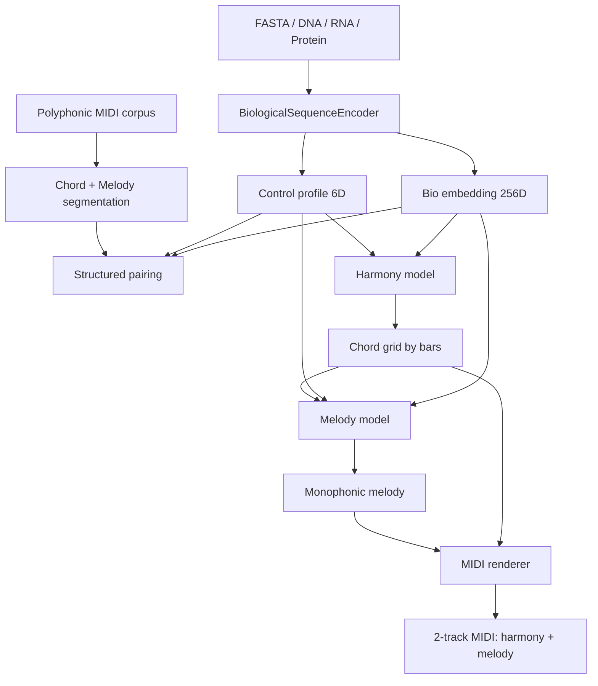

# BioSonification

Проект генерирует символическую музыку по биологическим последовательностям. Основной контур реализован как иерархический пайплайн `Bio -> Harmony -> Melody`: сначала из FASTA извлекаются biologically informed признаки, затем по ним генерируется аккордовая сетка по тактам, а после этого отдельная модель строит монофоническую мелодию поверх этой гармонии.

**Ключевая особенность:** Для длинных последовательностей используется **фрагментированная генерация** — входная последовательность разбивается на фрагменты обучающей длины (1800 bp), для каждого генерируется короткий музыкальный сегмент (4 или 8 тактов), затем все сегменты склеиваются в одну длинную композицию. Это обеспечивает стабильное качество независимо от длины входной последовательности.

## Что делает текущий пайплайн



## Доступные модели

Проект включает две обученные модели с разными характеристиками:

### 4-тактовая модель (рекомендуется)
- **Путь:** `results/v2_medium_rtx2060_fast/checkpoints/structured_pipeline.pt`
- **Конфиг:** `configs/pipeline_v2_medium_rtx2060_fast.json`
- **Архитектура:** 384D, 6 heads, 6 layers
- **Обучающие данные:** 4-тактовые сегменты из POP909
- **Validation loss:** Harmony 0.145, Melody 0.157 (лучше!)
- **Использование:** Фрагментированная генерация с `bars_per_fragment=4`

### 8-тактовая модель
- **Путь:** `results/v2_medium_rtx2060_long/checkpoints/structured_pipeline.pt`
- **Конфиг:** `configs/pipeline_v2_medium_rtx2060_long.json`
- **Архитектура:** 384D, 6 heads, 6 layers
- **Обучающие данные:** 8-тактовые сегменты из POP909
- **Validation loss:** Harmony 0.179, Melody 0.215
- **Использование:** Фрагментированная генерация с `bars_per_fragment=8`

**Почему 4-тактовая модель лучше:**
- Меньший validation loss → лучшее качество генерации
- Более короткие сегменты → больше разнообразия при фрагментированной генерации
- Лучше обобщается на новые данные

## Архитектурные свойства

- Гармония и мелодия разделены на два нейросетевых этапа.
- Мелодия жёстко ограничена гармонической сеткой и нормализуется в монофоническую линию без самоналожений.
- Биологический слой использует готовые биоинформатические решения: `Biopython ProtParam`, `ViennaRNA`, опционально `ESM` через `transformers`.
- Pairing строится по структурированным музыкальным дескрипторам.

## Основные файлы

Основной путь разработки и запуска:

- `train_bio_music_v2.py`
- `generate_from_fasta_v2.py`
- `configs/pipeline_v2_small.json`
- `bio_music_pipeline/v2/structured_*`
- `bio_music_pipeline/v2/evaluate.py`
- `bio_music_pipeline/v2/dataset_report.py`
- `web/`

## Текущая реализация

Основные модули:

- `bio_music_pipeline/v2/bio.py`: sequence encoder, ORF, protein features, RNA folding, optional ESM
- `bio_music_pipeline/v2/corpus.py`: поиск score-файлов и fallback-корпус `music21`
- `bio_music_pipeline/v2/structured_music.py`: извлечение аккордов и мелодии из полифонического корпуса, токенизация, рендер MIDI
- `bio_music_pipeline/v2/structured_pairing.py`: pairing bio fragments и музыкальных сегментов
- `bio_music_pipeline/v2/structured_model.py`: autoregressive Transformer с conditioning по bio vector
- `bio_music_pipeline/v2/structured_train.py`: обучение `harmony model` и `melody model`
- `bio_music_pipeline/v2/structured_generate.py`: inference `FASTA -> MIDI`
- `bio_music_pipeline/v2/evaluate.py`: evaluation metrics и baseline
- `bio_music_pipeline/v2/dataset_report.py`: manifest данных

CLI:

- `train_bio_music_v2.py` — обучение моделей
- `generate_from_fasta_v2.py` — генерация из FASTA (baseline, использует только первый фрагмент)
- `generate_from_fasta_v2_fragmented.py` — **фрагментированная генерация** (рекомендуется для длинных последовательностей)

Веб-интерфейс:

- `web/app.py` — Flask-приложение с веб-интерфейсом
- Автоматически использует фрагментированную генерацию с 4-тактовой моделью

## Быстрый старт

Подготовка окружения:

```powershell
python -m venv .venv
.\.venv\Scripts\python.exe -m pip install --upgrade pip
.\.venv\Scripts\python.exe -m pip install torch --index-url https://download.pytorch.org/whl/cu126
.\.venv\Scripts\python.exe -m pip install -r requirements.txt
```

Проверка GPU:

```powershell
@'
import torch
print(torch.__version__)
print("cuda:", torch.cuda.is_available())
if torch.cuda.is_available():
    print(torch.cuda.get_device_name(0))
'@ | .\.venv\Scripts\python.exe -
```

Обучение (4-тактовая модель, рекомендуется):

```powershell
.\.venv\Scripts\python.exe train_bio_music_v2.py --config configs\pipeline_v2_medium_rtx2060_fast.json
```

Генерация из FASTA (фрагментированная, рекомендуется):

```powershell
.\.venv\Scripts\python.exe generate_from_fasta_v2_fragmented.py `
  --checkpoint results\v2_medium_rtx2060_fast\checkpoints\structured_pipeline.pt `
  --fasta data\fasta\refseq_genomes\GCF_000005845.2_genomic.fna `
  --output results\generated_music\ecoli_fragmented.mid `
  --bars-per-fragment 4 `
  --metadata-output results\generated_music\ecoli_fragmented.json
```

Запуск веб-интерфейса:

```powershell
.\.venv\Scripts\python.exe -m web.app
# Откройте http://localhost:5001
```

## Что проверять после запуска

После обучения 4-тактовой модели:

- `results/v2_medium_rtx2060_fast/checkpoints/structured_pipeline.pt`
- `results/v2_medium_rtx2060_fast/checkpoints/harmony_best.pt`
- `results/v2_medium_rtx2060_fast/checkpoints/melody_best.pt`
- `results/v2_medium_rtx2060_fast/metrics.json`
- `results/v2_medium_rtx2060_fast/smoke/structured_sample.mid`

После фрагментированной генерации:

- `results/generated_music/ecoli_fragmented.mid` — MIDI файл с гармонией и мелодией
- `results/generated_music/ecoli_fragmented.json` — метаданные:
  - `num_fragments` — количество фрагментов
  - `total_bars` — общее количество тактов
  - `total_melody_notes` — общее количество нот мелодии
  - `fragments` — детали по каждому фрагменту (темп, количество нот)

Быстрая техническая проверка:

```powershell
@'
from music21 import converter
score = converter.parse("results/generated_music/ecoli_fragmented.mid")
print("highestTime:", float(score.highestTime))
for i, part in enumerate(score.parts):
    print("part", i, "notes", len(list(part.flatten().notes)))
'@ | .\.venv\Scripts\python.exe -
```

Ожидаемый результат для фрагментированной генерации:

- `score.highestTime` = `num_fragments * bars_per_fragment * 4.0` (quarter notes)
- 2 партии: гармония (аккорды) и мелодия (монофоническая линия)
- Количество нот мелодии соответствует `total_melody_notes` из метаданных
- Для длинных последовательностей (>1800 bp) генерируется несколько фрагментов

## Оценка результата

Минимальный evaluation-run для structured `v2`:

```powershell
.\.venv\Scripts\python.exe tools\evaluate_structured_v2.py --checkpoint results\v2_music21_rtx2060\checkpoints\structured_pipeline.pt --fasta data\fasta\quick_sample.fa --output-dir results\v2_evaluation --max-records 4 --device auto
```

Команда генерирует MIDI для нескольких FASTA fragments, строит random harmony+melody baseline и сохраняет:

- `results/v2_evaluation/evaluation_report.json`
- `results/v2_evaluation/evaluation_report.md`
- `results/v2_evaluation/midi/*.mid`

Метрики проверяют структуру MIDI, плотность мелодии, pitch range, chord change rate, chord-tone ratio, self-similarity и invalid generation rate.

## Отчёт по данным

Перед обучением или оценкой можно зафиксировать manifest используемых FASTA/MIDI данных:

```powershell
.\.venv\Scripts\python.exe tools\report_structured_dataset.py --config configs\pipeline_v2_small.json --output-dir results\v2_dataset_report
```

Отчёт сохраняет:

- `results/v2_dataset_report/dataset_report.json`
- `results/v2_dataset_report/dataset_report.md`

Fallback-корпус `music21` помечается как demo/smoke-test источник. Для серьёзных экспериментов лучше указывать внешний лицензированный полифонический MIDI-корпус в `music.midi_dirs`.

## Документация

- [RUN_FROM_SCRATCH.md](RUN_FROM_SCRATCH.md): полный запуск с нуля
- [docs/architecture_and_science.md](docs/architecture_and_science.md): постановка задачи и методология
- [docs/code_walkthrough.md](docs/code_walkthrough.md): разбор модулей
- [docs/project_structure.md](docs/project_structure.md): файловая карта
- [docs/thesis_experiment_summary.md](docs/thesis_experiment_summary.md): финальный эксперимент для диплома

## Локально подтверждено

На текущем устройстве с `RTX 2060 6 GB` проверено:

- `torch` видит CUDA
- `pytest` проходит
- обучение structured pipeline завершается успешно
- `metrics.json` показывает убывающие `harmony` и `melody` losses
- отдельная генерация из FASTA создаёт двухдорожечный MIDI с фиксированной длиной и монофонической мелодией

## Ограничения

- Этап `Bio + Harmony + Melody -> Accompaniment` пока сознательно не реализован.
- `ESM` включён опционально и по умолчанию выключен в small-конфиге, чтобы укладываться в память `RTX 2060 6 GB`.
- Для по-настоящему богатой музыки лучше заменить fallback `music21` corpus на более крупный внешний полифонический корпус.
- Биологические признаки используются как conditioning signals. Проект не доказывает причинную связь между генами и музыкальными структурами.
- Runtime-артефакты (`results/`, `outputs/`, `tmp/`, `web/output/`) не должны храниться в git; воспроизводимые результаты нужно описывать через конфиги, метрики и manifest-файлы.

## Эволюция подхода

### Baseline (v1)
- Генерация одной длинной композиции за раз
- Адаптивная длина: `num_bars = max(8, min(32, sequence_length // 200))`
- **Проблема:** Для длинных последовательностей (>1800 bp) модель выходит за пределы обучающего распределения → качество падает, гармония повторяется, мелодия становится монотонной

### Фрагментированная генерация (v2, текущая)
- Входная последовательность разбивается на фрагменты по 1800 bp (обучающая длина)
- Для каждого фрагмента генерируется короткий сегмент (4 или 8 тактов)
- Все сегменты склеиваются в одну композицию
- **Преимущества:**
  - Каждый фрагмент генерируется в пределах обучающего распределения → стабильное качество
  - Длинные последовательности → длинные композиции без потери качества
  - Больше разнообразия (каждый фрагмент имеет свой био-вектор)
- **Результаты:** Для 10000 bp последовательности генерируется 24 такта (6 фрагментов × 4 такта) вместо 9 тактов в baseline

### Выбор модели
- **8-тактовая модель:** Обучена на 8-тактовых сегментах, val_loss выше
- **4-тактовая модель (выбрана):** Обучена на 4-тактовых сегментах, val_loss ниже на 19% (harmony) и 27% (melody)
- Меньшие сегменты → лучшее обобщение → выше качество
