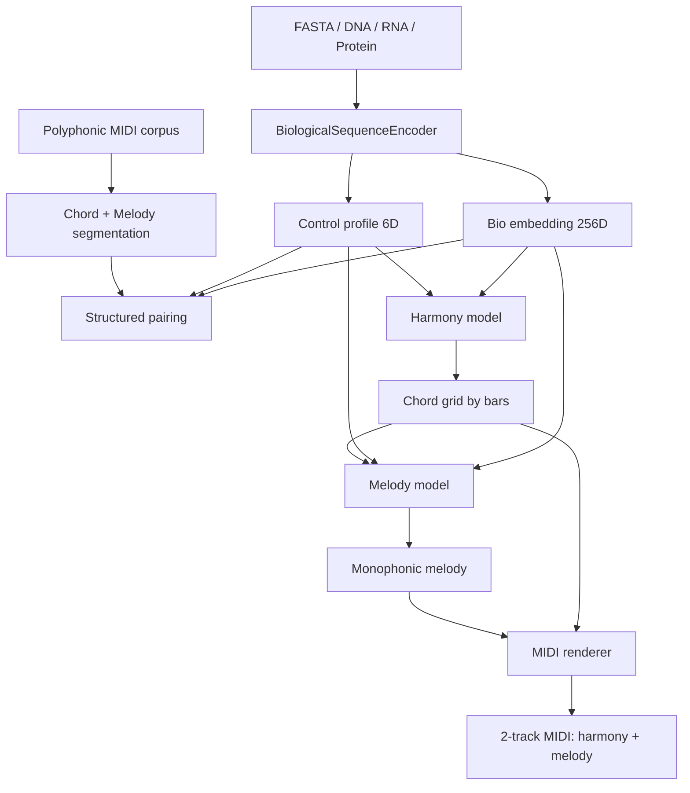

# BioSonification

Проект генерирует символическую музыку по биологическим последовательностям. Текущий основной контур реализован как иерархический пайплайн `Bio -> Harmony -> Melody`: сначала из FASTA извлекаются biologically informed признаки, затем по ним генерируется аккордовая сетка по тактам, а после этого отдельная модель строит монофоническую мелодию поверх этой гармонии.

Старый стек на `run_pipeline.py` и ранний single-stream `v2` в репозитории оставлены, но считаются legacy. Рабочий и рекомендуемый путь запуска сегодня проходит через `bio_music_pipeline/v2/structured_*`, `train_bio_music_v2.py` и `generate_from_fasta_v2.py`.

## Что делает текущий пайплайн



## Ключевые отличия от старой версии

- Музыка больше не генерируется как один хаотичный поток событий.
- Гармония и мелодия разделены на два нейросетевых этапа.
- Мелодия жёстко ограничена гармонической сеткой и нормализуется в монофоническую линию без самоналожений.
- Биологический слой использует готовые биоинформатические решения: `Biopython ProtParam`, `ViennaRNA`, опционально `ESM` через `transformers`.
- Pairing строится по структурированным музыкальным дескрипторам, а не по одному scalar complexity score.

## Что является актуальным

Актуальный путь разработки и запуска:

- `train_bio_music_v2.py`
- `generate_from_fasta_v2.py`
- `configs/pipeline_v2_small.json`
- `bio_music_pipeline/v2/structured_*`
- `web/` после переподключения к `structured_pipeline.pt`

Legacy-слои (`run_pipeline.py`, `generate_from_fasta.py`, ранние single-stream `bio_music_pipeline/v2/model.py`, `dataset.py`, `train.py`, `generate.py`) оставлены для истории и сравнения, но не считаются основным рабочим контуром.

## Текущая реализация

Основные модули:

- `bio_music_pipeline/v2/bio.py`: sequence encoder, ORF, protein features, RNA folding, optional ESM
- `bio_music_pipeline/v2/structured_music.py`: извлечение аккордов и мелодии из полифонического корпуса, токенизация, рендер MIDI
- `bio_music_pipeline/v2/structured_pairing.py`: pairing bio fragments и музыкальных сегментов
- `bio_music_pipeline/v2/structured_model.py`: autoregressive Transformer с conditioning по bio vector
- `bio_music_pipeline/v2/structured_train.py`: обучение `harmony model` и `melody model`
- `bio_music_pipeline/v2/structured_generate.py`: inference `FASTA -> MIDI`

CLI:

- `train_bio_music_v2.py`
- `generate_from_fasta_v2.py`

## Быстрый старт

Подготовка окружения:

```powershell
python -m venv .venv
.\.venv\Scripts\python.exe -m pip install --upgrade pip
.\.venv\Scripts\python.exe -m pip install torch --index-url https://download.pytorch.org/whl/cu126
.\.venv\Scripts\python.exe -m pip install -r requirements.txt
```

Проверка GPU:

```powershell
@'
import torch
print(torch.__version__)
print("cuda:", torch.cuda.is_available())
if torch.cuda.is_available():
    print(torch.cuda.get_device_name(0))
'@ | .\.venv\Scripts\python.exe -
```

Обучение:

```powershell
.\.venv\Scripts\python.exe train_bio_music_v2.py --config configs\pipeline_v2_small.json
```

Генерация из FASTA:

```powershell
.\.venv\Scripts\python.exe generate_from_fasta_v2.py --config configs\pipeline_v2_small.json --checkpoint results\v2_music21_rtx2060\checkpoints\structured_pipeline.pt --fasta data\fasta\quick_sample.fa --output results\v2_generation\structured_from_fasta.mid --metadata-output results\v2_generation\structured_from_fasta.json
```

## Что проверять после запуска

После обучения:

- `results/v2_music21_rtx2060/checkpoints/structured_pipeline.pt`
- `results/v2_music21_rtx2060/checkpoints/harmony_best.pt`
- `results/v2_music21_rtx2060/checkpoints/melody_best.pt`
- `results/v2_music21_rtx2060/metrics.json`
- `results/v2_music21_rtx2060/smoke/structured_sample.mid`

После генерации:

- `results/v2_generation/structured_from_fasta.mid`
- `results/v2_generation/structured_from_fasta.json`

Быстрая техническая проверка:

```powershell
@'
from music21 import converter
score = converter.parse("results/v2_generation/structured_from_fasta.mid")
print("highestTime:", float(score.highestTime))
for i, part in enumerate(score.parts):
    print("part", i, "notes", len(list(part.flatten().notes)))
'@ | .\.venv\Scripts\python.exe -
```

Нормальный результат для текущего structured-пайплайна:

- `score.highestTime` совпадает с длиной гармонической сетки
- 2 партии: гармония и мелодия
- в гармонии лежат аккорды по тактам
- мелодия остаётся монофонической

## Документация

- [RUN_FROM_SCRATCH.md](RUN_FROM_SCRATCH.md): полный запуск с нуля
- [docs/architecture_and_science.md](docs/architecture_and_science.md): постановка задачи и методология
- [docs/code_walkthrough.md](docs/code_walkthrough.md): разбор модулей
- [docs/project_structure.md](docs/project_structure.md): файловая карта

## Локально подтверждено

На текущем устройстве с `RTX 2060 6 GB` проверено:

- `torch` видит CUDA
- `pytest` проходит
- обучение structured pipeline завершается успешно
- `metrics.json` показывает убывающие `harmony` и `melody` losses
- отдельная генерация из FASTA создаёт двухдорожечный MIDI с фиксированной длиной и монофонической мелодией

## Ограничения

- Этап `Bio + Harmony + Melody -> Accompaniment` пока сознательно не реализован.
- `ESM` включён опционально и по умолчанию выключен в small-конфиге, чтобы укладываться в память `RTX 2060 6 GB`.
- Для по-настоящему богатой музыки лучше заменить fallback `music21` corpus на более крупкий внешний полифонический корпус.
- Биологические признаки используются как conditioning signals. Проект не доказывает причинную связь между генами и музыкальными структурами.
- Runtime-артефакты (`results/`, `outputs/`, `tmp/`, `web/output/`) не должны храниться в git; воспроизводимые результаты нужно описывать через конфиги, метрики и manifest-файлы.
